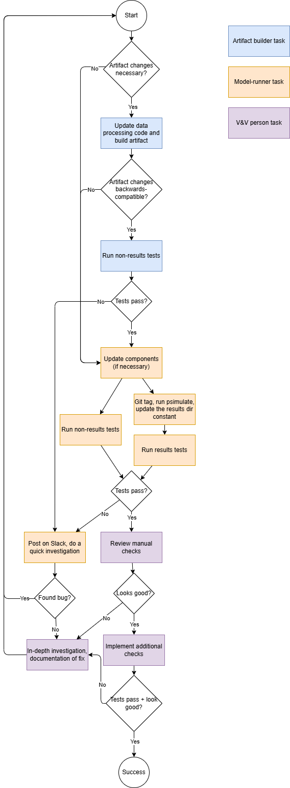

===============================
vivarium_gates_mncnh
===============================

Research repository for the vivarium_gates_mncnh project.

.. contents::
   :depth: 1

Installation
------------

You will need ``conda`` to install all of this repository's requirements.
We recommend installing `Miniforge <https://github.com/conda-forge/miniforge>`_.

Once you have conda installed, you should open up your normal shell
(if you're on linux or OSX) or the ``git bash`` shell if you're on windows.

You'll then clone this repository and make the necessary environments.
The first step is to clone the repo::

  :~$ git clone https://github.com/ihmeuw/vivarium_gates_mncnh.git
  ...git will copy the repository from github and place it in your current directory...
  :~$ cd vivarium_gates_mncnh

Users can create environments by running
``bash environment.sh`` and ``bash environment.sh -t artifact`` which will automatically create and active conda environments
for running the simulation and artifact generation respectively.
The environment.sh script has extra options for users. To see these options, pass the 
``-h`` flag.

Alternatively, users can manually create the environments as follows::

  :~$ conda create --name=vivarium_gates_mncnh_simulation python=3.11 git git-lfs
  ...conda will download python and base dependencies...
  :~$ conda activate vivarium_gates_mncnh_simulation
  (vivarium_gates_mncnh_simulation) :~$ pip install -r requirements.txt
  (vivarium_gates_mncnh_simulation) :~$ pip install -e .[dev]
  ...pip will install vivarium and other requirements...
  (vivarium_gates_mncnh_simulation) :~$ conda deactivate
  :~$ conda create --name=vivarium_gates_mncnh_artifact python=3.11 git git-lfs
  ...conda will download python and base dependencies...
  :~$ conda activate vivarium_gates_mncnh_artifact
  (vivarium_gates_mncnh_artifact) :~$ pip install -r artifact_requirements.txt
  (vivarium_gates_mncnh_artifact) :~$ pip install -e .[dev]
  ...pip will install vivarium and other requirements...

Supported Python versions: 3.10, 3.11

Note the ``-e`` flag that follows pip install. This will install the python
package in-place, which is important for making the model specifications later.

Vivarium uses the Hierarchical Data Format (HDF) as the backing storage
for the data artifacts that supply data to the simulation. You may not have
the needed libraries on your system to interact with these files, and this is
not something that can be specified and installed with the rest of the package's
dependencies via ``pip``. If you encounter HDF5-related errors, you should
install hdf tooling from within your environment like so::

  (vivarium_gates_mncnh) :~$ conda install hdf5

The ``(vivarium_gates_mncnh)`` that precedes your shell prompt will probably show
up by default, though it may not.  It's just a visual reminder that you
are installing and running things in an isolated programming environment
so it doesn't conflict with other source code and libraries on your
system.

Usage
-----

You'll find six directories inside the main
``src/vivarium_gates_mncnh`` package directory:

- ``artifacts``

  This directory contains all input data used to run the simulations.
  You can open these files and examine the input data using the vivarium
  artifact tools.  A tutorial can be found at https://vivarium.readthedocs.io/en/latest/tutorials/artifact.html#reading-data

- ``components``

  This directory is for Python modules containing custom components for
  the vivarium_gates_mncnh project. You should work with the
  engineering staff to help scope out what you need and get them built.

- ``data``

  If you have **small scale** external data for use in your sim or in your
  results processing, it can live here. This is almost certainly not the right
  place for data, so make sure there's not a better place to put it first.

- ``model_specifications``

  This directory should hold all model specifications and branch files
  associated with the project.

- ``results_processing``

  Any post-processing and analysis code or notebooks you write should be
  stored in this directory.

- ``tools``

  This directory hold Python files used to run scripts used to prepare input
  data or process outputs.

When performing merges in this repository, due to the presence of notebooks, there may be conflicts more often than you expect.
Both the simulation and artifact environments have `nbdime` installed, which makes these conflicts easier to resolve.
Simply open the conflicting notebooks in a notebook editor (e.g. JupyterLab or VS Code) and resolve the conflicts within that interface.

Running Simulations
-------------------

You will need to repeat the entire process documented here for each location you want to run for.
Only Pakistan, Nigeria, and Ethiopia are supported currently.
In all commands here, we use Pakistan as an example;
replace "Pakistan" with the name of the location of interest.

To run this simulation, the first step is to analyze GBD data to generate "caps" (maximum values)
for relative risks of low birthweight and short gestation (LBWSG).
Note that this takes a while to run (about an hour).
If you don't want to re-generate the RR caps, you can skip this step and simply use the pre-generated
files included in this repo.
Generating the caps is achieved with:::

  :~$ conda activate vivarium_gates_mncnh_artifact
  (vivarium_gates_mncnh_artifact) :~$ python src/vivarium_gates_mncnh/data/lbwsg_rr_caps/generate_caps.py -l Pakistan -o src/vivarium_gates_mncnh/data/lbwsg_rr_caps/caps/

The next step is to generate an artifact with base GBD data in it.
This will only work on the IHME cluster, because it pulls draw-level data from internal GBD databases.:::

  :~$ conda activate vivarium_gates_mncnh_artifact
  (vivarium_gates_mncnh_artifact) :~$ make_artifacts -vvv -l "Pakistan" -o artifacts/

This command will create an artifact file in the ``artifacts/`` directory within the repo;
omit the ``-o`` argument to output to the default location of ``/mnt/team/simulation_science/pub/models/vivarium_gates_mncnh/artifacts``,
or change to a different path.

The next step is to run an initial simulation to calculate population-attributable fractions (PAFs)
for LBWSG in the early neonatal period.
*Edit* the ``time`` section of ``src/vivarium_gates_mncnh/data/lbwsg_paf.yaml`` so that the ``end``
is only one day after the ``start``, then run:::

  :~$ conda activate vivarium_gates_mncnh_simulation
  (vivarium_gates_mncnh_simulation) :~$ simulate run -vvv src/vivarium_gates_mncnh/data/lbwsg_paf.yaml -i artifacts/pakistan.hdf -o paf_sim_results/

The ``-v`` flag will log verbosely, so you will get log messages every time
step. For more ways to run simulations, see the tutorials at
https://vivarium.readthedocs.io/en/latest/tutorials/running_a_simulation/index.html
and https://vivarium.readthedocs.io/en/latest/tutorials/exploration.html

This command will output results in the ``paf_sim_results/`` directory within the repo;
omit the ``-o`` argument to output to the default location in your home directory (``~/vivarium_results/lbwsg_paf/``),
or change to a different path.

The last line of output will tell you the specific directory to which results were written.
Make a directory for holding these results, and copy them there, as follows:::

  :~$ mkdir -p calculated_pafs/temp_outputs/pakistan/
  :~$ cp <your results directory>/calculated_lbwsg_paf*.parquet calculated_pafs/temp_outputs/pakistan/

Now *edit* the ``PAF_DIR =`` line of ``src/vivarium_gates_mncnh/constants/paths.py`` to set the value to
``Path("calculated_pafs/")``.
You'll now re-run the ``make_artifacts`` command, updating the relevant PAFs:::

  :~$ conda activate vivarium_gates_mncnh_artifact
  (vivarium_gates_mncnh_artifact) :~$ make_artifacts -vvv -l "Pakistan" -o artifacts/ -r risk_factor.low_birth_weight_and_short_gestation.population_attributable_fraction -r cause.neonatal_preterm_birth.population_attributable_fraction

Next we'll repeat the process to calculate PAFs and preterm prevalence for late neonatals.
*Undo* your edits in the ``time`` section of ``src/vivarium_gates_mncnh/data/lbwsg_paf.yaml``
and re-run:::

  :~$ conda activate vivarium_gates_mncnh_simulation
  (vivarium_gates_mncnh_simulation) :~$ simulate run -vvv src/vivarium_gates_mncnh/data/lbwsg_paf.yaml -i artifacts/pakistan.hdf -o paf_sim_results/

*Edit* the ``PRETERM_PREVALENCE_DIR =`` line of ``src/vivarium_gates_mncnh/constants/paths.py`` to set the value to
``Path("calculated_preterm_prevalence/")``.
Copy your results to ``calculated_pafs`` and ``calculated_preterm_prevalence``, overwriting the previous results:

  :~$ cp <your results directory>/calculated_lbwsg_paf*.parquet calculated_pafs/temp_outputs/pakistan/
  :~$ mkdir -p calculated_preterm_prevalence/pakistan/
  :~$ cp <your results directory>/calculated_late_neonatal_preterm*.parquet calculated_preterm_prevalence/pakistan/

You'll now re-run the ``make_artifacts`` command, updating the relevant PAFs:::

  :~$ conda activate vivarium_gates_mncnh_artifact
  (vivarium_gates_mncnh_artifact) :~$ make_artifacts -vvv -l "Pakistan" -o artifacts/ -r risk_factor.low_birth_weight_and_short_gestation.population_attributable_fraction -r cause.neonatal_preterm_birth.population_attributable_fraction -r cause.neonatal_preterm_birth.prevalence

You are now ready to run the main simulation with::

  :~$ conda activate vivarium_gates_mncnh_simulation
  (vivarium_gates_mncnh_simulation) :~$ simulate run -vvv src/vivarium_gates_mncnh/model_specifications/model_spec.yaml -i artifacts/pakistan.hdf -o sim_results/

Results of the simulation will be written to ``sim_results/``.
For example, you can check the total deaths due to maternal disorders by
summing the ``value`` column in the Parquet file at
``sim_results/pakistan/<timestamp>/results/maternal_disorders_burden_observer_disorder_deaths.parquet``.

V&V process
-----------

We do not merge changes to the **main** branch until they have passed verification and validation (V&V).
Other branches, such as epic branches, can be merged to without V&V; only code review is required.
The reasoning for this is that V&V is quite a bit more involved than typical software testing, and may involve multiple people.
We make separate branches and pull requests for each *person's* contribution, so that their code can be reviewed by others.

Note that we may sometimes run and V&V models we do *not* intend to merge, e.g. sensitivity analyses or experiments. In that case,
we would simply close the PRs without merging once the process is complete.

The V&V process is performed through our ``pytest`` suite.
The test suite contains some tests that run the simulation (using the ``InteractiveContext``),
and other tests that perform checks on the results of an already-run simulation (run with ``psimulate``).
Currently, some of these tests are in Python files, and some are in notebooks.
In the notebooks, there are also some checks which are not ``assert`` statements,
but require manual review of the notebook outputs to confirm that they are correct.
When notebook tests are run, the notebook outputs are saved to the ``executed`` subdirectories,
and must be committed to the repo.

For environment-management reasons, the Python tests run in the simulation environment, and the notebook tests run in the artifact environment.
This means that "running the tests" involves running the test suite in both environments.

In general, for each V&V process, there are three roles to play: the artifact-builder, the model-runner, and the V&V person.
The artifact-builder makes the changes to the artifact,
the model-runner makes any necessary changes to the components and runs the model,
and the V&V person does the final sign-off that the model is working as expected.
We **require** the model-runner and V&V person to be two separate people,
and the artifact-builder and V&V person to be two separate people, but the artifact-builder and model-runner can be the same person.
Historically, the artifact-builder and model-runner have been engineers,
though with task shifting it is becoming more common for folks on the research side to take on these roles.
The V&V person is always on the research side.

It is encouraged to keep non-main branches up to date with main, and to merge the latest changes from main
before doing the V&V process on a branch.
However, in the case that parallel development results in V&V on a branch being done without changes that are merged to main before that branch is,
V&V should be repeated once the branch is updated with the latest changes from main.

Anytime the V&V process hands from one person (not role) to another,
a new branch and pull request is made, based off the last.
This way each PR contains only the changes made by one person, and the others can review.

If a bug is found, the process re-starts in a new branch.
The person best-positioned to fix the bug is identified according to the nature of the bug,
and they become the artifact-builder and model-runner for the next iteration.
The V&V person does not change.

If no issues are found, the V&V person gives their sign-off that the branch is ready to be merged to main.
At this point *all* branches involved may be merged to main (if they've been code-reviewed), in whatever
order is most convenient according to potential merge conflicts and who would be better placed to resolve them.

The process works as follows:

Additional details on individual tasks follow.

**Update data processing code and build artifact**

* Build the artifact to a directory named descriptively using words rather than a model number
(which has not yet been assigned).
* Be sure to update the model specification to point to the new artifact location.

**Git tag, run psimulate, update the model results dir constant**

Because V&V involves saving outputs to the shared drive, we number all model runs
and make the shared drive directories correspond to these numbers.

We do not assign the model number until just before running the simulation.
The model number must be of the form X.Y.Z and should be unique, and strictly *after*
any other model number which is a git ancestor of it.
In order to track how these numbers map to git revisions, we tag
the git revision just before running the simulation with the model number.
The directory where the artifact has been stored (named using words) should be
renamed to match the model number, before starting runs.

When running ``psimulate``, the output directory should be set to a directory named with the model number.
The  MODEL_RESULTS_DIR constant in ``src/vivarium_gates_mncnh/constants/paths.py``
should be updated to reflect the new directory where results are being written,
so that the tests will be checking the correct results.

**Post on Slack, do a quick investigation**

The person who encounters the test failure should post on Slack right away, then do a quick investigation into why the tests are failing,
time-boxed to 15 minutes.
If this does not identify a bug, the issue will be escalated to the V&V person.