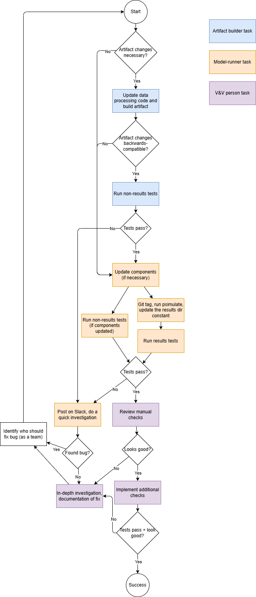

===============================
vivarium_gates_mncnh
===============================

Research repository for the vivarium_gates_mncnh project.

.. contents::
   :depth: 1

Installation
------------

You will need ``conda`` to install all of this repository's requirements.
We recommend installing `Miniforge <https://github.com/conda-forge/miniforge>`_.

Once you have conda installed, you should open up your normal shell
(if you're on linux or OSX) or the ``git bash`` shell if you're on windows.

You'll then clone this repository and make the necessary environments.
The first step is to clone the repo::

  :~$ git clone https://github.com/ihmeuw/vivarium_gates_mncnh.git
  ...git will copy the repository from github and place it in your current directory...
  :~$ cd vivarium_gates_mncnh

There are two environment options: a **local conda environment** (for personal machines)
or a **shared environment on the cluster** with a lightweight venv wrapper.

To create or update an environment, use ``source environment.sh``. This will
automatically create the environment if it doesn't exist, or rebuild it if its
package versions no longer match the repository's version files (see
`Pinned package versions`_ below).

**Local conda environment** (default)::

  :~$ source environment.sh
  ...creates/activates the simulation conda environment...
  :~$ source environment.sh -t artifact
  ...creates/activates the artifact conda environment...

To deactivate a local conda environment, run ``conda deactivate``.

**Shared environment on the cluster** (recommended for cluster development)::

  :~$ source environment.sh -s
  ...creates/activates a venv overlay on the shared simulation environment...
  :~$ source environment.sh -s -t artifact
  ...creates/activates a venv overlay on the shared artifact environment...

To deactivate a shared cluster environment, run ``deactivate``.

Additional options are available; pass the ``-h`` flag to see them
(e.g. ``-f`` to force a rebuild, ``-l`` to install git lfs).

Pinned package versions
+++++++++++++++++++++++

Every environment is built from committed, fully pinned version files:

- ``requirements/simulation.txt`` pins every package in the simulation
  environment (``pip install -e .[dev]``).
- ``requirements/artifact.txt`` pins every package in the artifact
  environment (``pip install -e .[data]``). The ``data`` extra also sets a
  minimum version for ``jobmon_installer_ihme``, because older jobmon releases
  break in fresh environments (no ``pkg_resources``, incompatible
  ``slurm_rest``).
- ``requirements/resolver-constraints.txt`` is not a version file and is not
  installed from. It holds lower bounds that only the lock targets below pass to
  the resolver (``-c``). At present it keeps the IHME data packages
  (``ihme-cc-aggregate``, ``ihme-cc-get-estimates``) from being downgraded to
  make room for the newer jobmon.

``pyproject.toml`` still declares what the package is *compatible* with (version
ranges); the version files record exactly what the environments *run*. ``make
build-env``, the nightly shared environments, and the Jenkins PR builds all
install under them. The two files are resolved independently, so they will
disagree on some shared packages. That is on purpose and nothing reconciles them.

To change the version files, use one of two ``make`` targets (each accepts
``type=simulation``, ``type=artifact`` or ``type=all``, the default). Run them
from an activated environment of this repository: they need ``uv`` on your
``PATH``, and the ``vivarium_build_utils`` makefiles for the IHME package
index::

  :~$ make lock-versions
  ...resolves what is not pinned yet, preferring every existing pin...
  :~$ make upgrade-versions
  ...re-resolves every package to the newest version pyproject.toml allows...

- Use ``make lock-versions`` after adding or changing a dependency in
  ``pyproject.toml``. uv prefers the existing pins but does not guarantee them:
  if your change needs a pinned package to move, it moves. The target prints
  every pin that moved, was added or was removed, so you can check the diff
  shows only what your change needed.
- Use ``make upgrade-versions`` for a deliberate upgrade. Every package can move
  at once, so do this in its own PR and check the results.

Both targets resolve for the newest Python version in ``python_versions.json``
(``make build-env`` refuses any other ``py``), apply
``requirements/resolver-constraints.txt``, and also pin ``uv``, ``pip`` and
``setuptools``, the tools that build the environment. With ``type=all``, both
files are updated only if both resolve. Commit the changed version files along
with the change that needed them.

**What happens on activation.** ``make build-env`` records the version file it
was built from in the environment. Before recording it, ``make build-env``
checks the installed package versions against that version file. If they don't
match, the build fails and no record is written. Each ``source environment.sh``
compares that record with your checkout:

- For a local conda environment, if the version files changed (e.g. after a
  pull or a branch switch), ``environment.sh`` lists the packages that changed
  and the commit that changed them, then rebuilds. Environments are no longer
  rebuilt because of their age. Conda-level packages (Python, redis, git-lfs)
  are not covered by the version files; ``source environment.sh -f`` rebuilds
  them. Two other cases also rebuild:

  * an environment with no record of its versions, so every environment built
    before version files were introduced is rebuilt once;
  * a comparison that fails (e.g. a version file that does not parse), which
    prints a WARNING and then rebuilds.
- For a shared environment (``-s``), which cannot be rebuilt from your checkout,
  ``environment.sh`` only warns. It names the packages that differ and says why:

  * *your branch is behind main*: main has changed the version files since
    your branch left it. Merge main into your branch.
  * *your branch changed the version files* (or uses overrides): the shared
    environment cannot provide them. Build your own environment with
    ``source environment.sh -t <type>``.
  * *the shared environment is behind main*: your checkout matches main, but
    the shared environment has not yet been rebuilt. It will catch up after its
    next nightly rebuild. Until then you can build your own environment.

**Overrides.** To build against an unreleased framework change (e.g. a
``vivarium-public-health`` commit), add ``requirements/overrides.txt`` to your
branch. It uses uv's override format, one package per line. The framework
packages live in the ``ihmeuw/vivarium-suite`` monorepo, and ``subdirectory`` is
the package's directory under ``libs/``::

  vivarium-public-health @ git+https://github.com/ihmeuw/vivarium-suite@<commit sha>#subdirectory=libs/public-health

Overrides apply to both environment types and are recorded with the
environment. They are applied by ``make install`` (and so by ``make build-env``
and ``environment.sh``), which drops each overridden package's pin from the
version file it installs under, because the pin and the git reference cannot
both hold. Only the overridden package's own pin is dropped: its dependencies
stay pinned, so a framework commit that needs newer dependencies fails to
resolve until those pins are updated (edit ``pyproject.toml`` as needed and run
``make lock-versions``). An environment built with overrides prints a "not a standard
environment" banner listing them each time it is activated. Pin a commit SHA
rather than a branch name: the overrides file does not change when a branch
moves, so new commits on the branch do not trigger a rebuild. To pick them up,
update the SHA or run ``source environment.sh -f``. Overrides never go on
main. A GitHub workflow fails any pull request into main that contains
``requirements/overrides.txt``. Direct pushes to main skip that workflow, so
they rely on branch protection. Release the framework change, pin it in the
version files, and delete the overrides file before merging.

**Artifacts.** Like ``psimulate``, ``make_artifacts`` writes a
``requirements.txt`` listing the environment's packages to its output
directory. When a later build (a ``--resume``, or another location) writes into
the same directory under different package versions, it lists the differences
and asks before continuing. Declining aborts the build. Every build checks the
record first, before anything is deleted. After a fresh ``-l all`` build (not
``--append`` or ``--resume``) has deleted the existing artifacts (after asking),
the record is rewritten for the current environment if no ``.hdf`` files remain
in the directory, and left as is if any do.

Alternatively, users can manually create conda environments. The supported way
is to install the ``vivarium_build_utils`` version pinned in the type's version
file (it provides ``make install``), then run ``make install ENV_REQS=dev`` (or
``ENV_REQS=data``) from the activated environment. That applies the pins, any
overrides and the IHME package index for you::

  :~$ conda create --name=vivarium_gates_mncnh_simulation python=3.11 git git-lfs
  ...conda will download python and base dependencies...
  :~$ conda activate vivarium_gates_mncnh_simulation
  (vivarium_gates_mncnh_simulation) :~$ pip install "vivarium_build_utils==<version pinned in requirements/simulation.txt>"
  (vivarium_gates_mncnh_simulation) :~$ make install ENV_REQS=dev
  ...installs vivarium and other requirements at the pinned versions...
  (vivarium_gates_mncnh_simulation) :~$ conda deactivate
  :~$ conda create --name=vivarium_gates_mncnh_artifact python=3.11 git git-lfs
  ...conda will download python and base dependencies...
  :~$ conda activate vivarium_gates_mncnh_artifact
  (vivarium_gates_mncnh_artifact) :~$ pip install "vivarium_build_utils==<version pinned in requirements/artifact.txt>"
  (vivarium_gates_mncnh_artifact) :~$ make install ENV_REQS=data
  ...installs vivarium and other requirements at the pinned versions...

A manually built environment writes no record of its versions, so if you give
it one of the names ``environment.sh`` manages (as above), the next ``source
environment.sh`` rebuilds it. A plain ``pip install -e .[dev]`` (or
``.[data]``), or a ``uv pip install`` you run yourself, is **not** equivalent:
it skips the pins, the overrides or the IHME index.

Supported Python versions: 3.11

``make install`` installs the package in editable mode (``-e``), in place, which
is important for making the model specifications later.

Vivarium uses the Hierarchical Data Format (HDF) as the backing storage
for the data artifacts that supply data to the simulation. You may not have
the needed libraries on your system to interact with these files, and this is
not something that can be specified and installed with the rest of the package's
dependencies via ``pip``. If you encounter HDF5-related errors, you should
install hdf tooling from within your environment like so::

  (vivarium_gates_mncnh) :~$ conda install hdf5

The ``(vivarium_gates_mncnh)`` that precedes your shell prompt will probably show
up by default, though it may not.  It's just a visual reminder that you
are installing and running things in an isolated programming environment
so it doesn't conflict with other source code and libraries on your
system.

Usage
-----

You'll find six directories inside the main
``src/vivarium_gates_mncnh`` package directory:

- ``artifacts``

  This directory contains all input data used to run the simulations.
  You can open these files and examine the input data using the vivarium
  artifact tools.  A tutorial can be found at https://vivarium.readthedocs.io/en/latest/tutorials/artifact.html#reading-data

- ``components``

  This directory is for Python modules containing custom components for
  the vivarium_gates_mncnh project. You should work with the
  engineering staff to help scope out what you need and get them built.

- ``data``

  If you have **small scale** external data for use in your sim or in your
  results processing, it can live here. This is almost certainly not the right
  place for data, so make sure there's not a better place to put it first.

- ``model_specifications``

  This directory should hold all model specifications and branch files
  associated with the project.

- ``results_processing``

  Any post-processing and analysis code or notebooks you write should be
  stored in this directory.

- ``tools``

  This directory hold Python files used to run scripts used to prepare input
  data or process outputs.

When performing merges in this repository, due to the presence of notebooks, there may be conflicts more often than you expect.
Both the simulation and artifact environments have `nbdime` installed, which makes these conflicts easier to resolve.
Simply open the conflicting notebooks in a notebook editor (e.g. JupyterLab or VS Code) and resolve the conflicts within that interface.

Running Simulations
-------------------

You will need to repeat the entire process documented here for each location you want to run for.
Only Pakistan, Nigeria, and Ethiopia are supported currently.
In all commands here, we use Pakistan as an example;
replace "Pakistan" with the name of the location of interest.

To run this simulation, the first step is to analyze GBD data to generate "caps" (maximum values)
for relative risks of low birthweight and short gestation (LBWSG).
Note that this takes a while to run (about an hour).
If you don't want to re-generate the RR caps, you can skip this step and simply use the pre-generated
files included in this repo.
Generating the caps is achieved with:::

  :~$ source environment.sh -t artifact
  (vivarium_gates_mncnh_artifact) :~$ python src/vivarium_gates_mncnh/data/lbwsg_rr_caps/generate_caps.py -l Pakistan -o src/vivarium_gates_mncnh/data/lbwsg_rr_caps/caps/

The next step is to generate an artifact with base GBD data in it.
This will only work on the IHME cluster, because it pulls draw-level data from internal GBD databases.:::

  :~$ source environment.sh -t artifact
  (vivarium_gates_mncnh_artifact) :~$ make_artifacts -vvv -l "Pakistan" -o artifacts/

This command will create an artifact file in the ``artifacts/`` directory within the repo;
omit the ``-o`` argument to output to the default location of ``/mnt/team/simulation_science/pub/models/vivarium_gates_mncnh/artifacts``,
or change to a different path.

The next step is to run an initial simulation to calculate population-attributable fractions (PAFs)
for LBWSG in the early neonatal period.
*Edit* the ``time`` section of ``src/vivarium_gates_mncnh/data/lbwsg_paf.yaml`` so that the ``end``
is only one day after the ``start``, then run:::

  :~$ source environment.sh
  (vivarium_gates_mncnh_simulation) :~$ simulate run -vvv src/vivarium_gates_mncnh/data/lbwsg_paf.yaml -i artifacts/pakistan.hdf -o paf_sim_results/

The ``-v`` flag will log verbosely, so you will get log messages every time
step. For more ways to run simulations, see the tutorials at
https://vivarium.readthedocs.io/en/latest/tutorials/running_a_simulation/index.html
and https://vivarium.readthedocs.io/en/latest/tutorials/exploration.html

This command will output results in the ``paf_sim_results/`` directory within the repo;
omit the ``-o`` argument to output to the default location in your home directory (``~/vivarium_results/lbwsg_paf/``),
or change to a different path.

The last line of output will tell you the specific directory to which results were written.
Make a directory for holding these results, and copy them there, as follows:::

  :~$ mkdir -p calculated_pafs/temp_outputs/pakistan/
  :~$ cp <your results directory>/calculated_lbwsg_paf*.parquet calculated_pafs/temp_outputs/pakistan/

Now *edit* the ``PAF_DIR =`` line of ``src/vivarium_gates_mncnh/constants/paths.py`` to set the value to
``Path("calculated_pafs/")``.
You'll now re-run the ``make_artifacts`` command, updating the relevant PAFs:::

  :~$ conda activate vivarium_gates_mncnh_artifact
  (vivarium_gates_mncnh_artifact) :~$ make_artifacts -vvv -l "Pakistan" -o artifacts/ -r risk_factor.low_birth_weight_and_short_gestation.population_attributable_fraction -r cause.neonatal_preterm_birth.population_attributable_fraction

Next we'll repeat the process to calculate PAFs and preterm prevalence for late neonatals.
*Undo* your edits in the ``time`` section of ``src/vivarium_gates_mncnh/data/lbwsg_paf.yaml``
and re-run:::

  :~$ conda activate vivarium_gates_mncnh_simulation
  (vivarium_gates_mncnh_simulation) :~$ simulate run -vvv src/vivarium_gates_mncnh/data/lbwsg_paf.yaml -i artifacts/pakistan.hdf -o paf_sim_results/

*Edit* the ``PRETERM_PREVALENCE_DIR =`` line of ``src/vivarium_gates_mncnh/constants/paths.py`` to set the value to
``Path("calculated_preterm_prevalence/")``.
Copy your results to ``calculated_pafs`` and ``calculated_preterm_prevalence``, overwriting the previous results:

  :~$ cp <your results directory>/calculated_lbwsg_paf*.parquet calculated_pafs/temp_outputs/pakistan/
  :~$ mkdir -p calculated_preterm_prevalence/pakistan/
  :~$ cp <your results directory>/calculated_late_neonatal_preterm*.parquet calculated_preterm_prevalence/pakistan/

You'll now re-run the ``make_artifacts`` command, updating the relevant PAFs:::

  :~$ conda activate vivarium_gates_mncnh_artifact
  (vivarium_gates_mncnh_artifact) :~$ make_artifacts -vvv -l "Pakistan" -o artifacts/ -r risk_factor.low_birth_weight_and_short_gestation.population_attributable_fraction -r cause.neonatal_preterm_birth.population_attributable_fraction -r cause.neonatal_preterm_birth.prevalence

You are now ready to run the main simulation with::

  :~$ conda activate vivarium_gates_mncnh_simulation
  (vivarium_gates_mncnh_simulation) :~$ simulate run -vvv src/vivarium_gates_mncnh/model_specifications/model_spec.yaml -i artifacts/pakistan.hdf -o sim_results/

Results of the simulation will be written to ``sim_results/``.
For example, you can check the total deaths due to maternal disorders by
summing the ``value`` column in the Parquet file at
``sim_results/pakistan/<timestamp>/results/maternal_disorders_burden_observer_disorder_deaths.parquet``.

V&V process
-----------

We do not merge changes to the **main** branch until they have passed verification and validation (V&V).
Other branches, such as epic branches, can be merged to without V&V; only code review is required.
The reasoning for this is that V&V is quite a bit more involved than typical software testing, and may involve multiple people.
We make separate branches and pull requests for each *person's* contribution, so that their code can be reviewed by others.

Note that we may sometimes run and V&V models we do *not* intend to merge, e.g. sensitivity analyses or experiments. In that case,
we would still follow this process to ensure we did the experiment correctly, then simply close the PRs without merging once the process is complete.

The V&V process is performed through our ``pytest`` suite.
The test suite contains some tests that run the simulation (using the ``InteractiveContext``),
and other tests that perform checks on the results of an already-run simulation (run with ``psimulate``).
Currently, some of these tests are in Python files, and some are in notebooks.
In the notebooks, there are also some checks which are not ``assert`` statements,
but require manual review of the notebook outputs to confirm that they are correct.
When notebook tests are run, the notebook outputs are saved to the ``executed`` subdirectories,
and must be committed to the repo.

For environment-management reasons, the Python tests run in the simulation environment, and the notebook tests run in the artifact environment.
This means that "running the tests" involves running the test suite in both environments.

In general, for each V&V process, there are four roles to play: the artifact-builder, the component-updater, the model-runner, and the V&V person.
The artifact-builder makes the changes to the artifact,
the component-updater makes any necessary changes to the components,
the model-runner runs the model,
and the V&V person does the final sign-off that the model is working as expected.
We **require** the model-runner and V&V person to be two separate people,
and the artifact-builder and V&V person to be two separate people, but besides that one person can wear multiple "hats."
Historically, the artifact-builder, component-updater, and model-runner have been engineers,
and the V&V person has been a researcher.
With task shifting, we are now primarily having folks on the research side take on the role of artifact-builder,
and sometimes also model-runner.
The model-runner is generally the same person as the artifact-builder if no component changes are needed,
or the same person as the component-updater if component changes are needed, but we haven't yet completely formalized this.

It is encouraged to keep non-main branches up to date with main, and to merge the latest changes from main
before doing the V&V process on a branch.
However, in the case that parallel development results in V&V on a branch being done without changes that are merged to main before that branch is,
V&V should be repeated once the branch is updated with the latest changes from main.

Anytime the V&V process hands from one person (not role) to another, and code changes must be made,
the person receiving the handoff should create a new branch off of the last branch, and make a pull request for that branch.
This way each PR contains only the changes made by one person, and the others can review.

If a bug is found, the process re-starts in a new branch.
The person best-positioned to fix the bug is identified according to the nature of the bug,
and they become the artifact-builder and/or component-updater (depending on where the bug is) for the next iteration.
The V&V person does not change.

If no issues are found, the V&V person gives their sign-off that the branch is ready to be merged to main.
At this point *all* branches involved may be merged to main (if they've been code-reviewed), in whatever
order is most convenient according to potential merge conflicts and who would be better placed to resolve them.

The process works as follows:

Additional details on individual tasks follow.

**Update data processing code and build artifact**

* Build the artifact to a directory named descriptively using words rather than a model number (which has not yet been assigned).
* Be sure to update the model specification to point to the new artifact location.

**Artifact changes backwards compatible?**

This question asks whether or not we expect that existing tests should pass with the new artifact,
without any changes to the simulation itself.
In general, the answer should be "yes" when artifact updates do not change the *structure* or *meaning* of existing keys.
Or in other words, when the only component changes you anticipate needing are adding *new* functionality,
rather than changing existing functionality.

**Git tag, run psimulate, update the model results dir constant**

Because V&V involves saving outputs to the shared drive, we number all model runs
and make the shared drive directories correspond to these numbers.

We do not assign the model number until just before running the simulation.
The model number must be of the form X.Y.Z[a] and should be unique, and strictly *after*
any other model number which is a git ancestor of it.
The [a] part indicates that a model may end with a letter, e.g. 21.0.1b.
The letter is *only* used when the model is a sensitivity analysis or experiment that should *not* be merged into main,
and it *must* be used in such cases to clearly differentiate these.
In order to track how these numbers map to git revisions, we tag
the git revision just before running the simulation with the model number.
The directory where the artifact has been stored (named using words) should be
renamed to match the model number, and the update to the artifact path committed to the model spec file, before starting runs.

When running ``psimulate``, the output directory should be set to a directory named with the model number.
The MODEL_RESULTS_DIR constant in ``src/vivarium_gates_mncnh/constants/paths.py``
should be updated to reflect the new directory where results are being written,
so that the tests will be checking the correct results.
Also, the model run should be tracked on the `MNCNH run tracker <https://uwnetid.sharepoint.com/:x:/s/ihme_simulation_science_team/ERyWpil0FLNDl4wfiEOns1EBnTbGctKsKzSKY_iKDTOmxw>`__.

**Post on Slack, do a quick investigation**

The person who encounters the test failure should post on Slack right away, then do a quick investigation into why the tests are failing,
time-boxed to 15 minutes.
If this does not identify a bug, the issue will be escalated to the V&V person.
